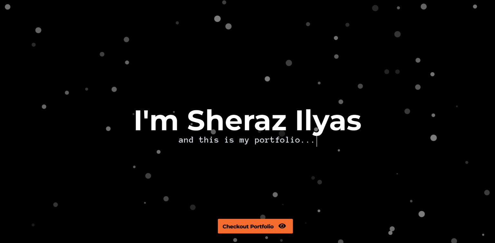
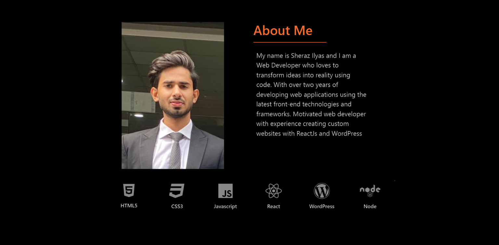
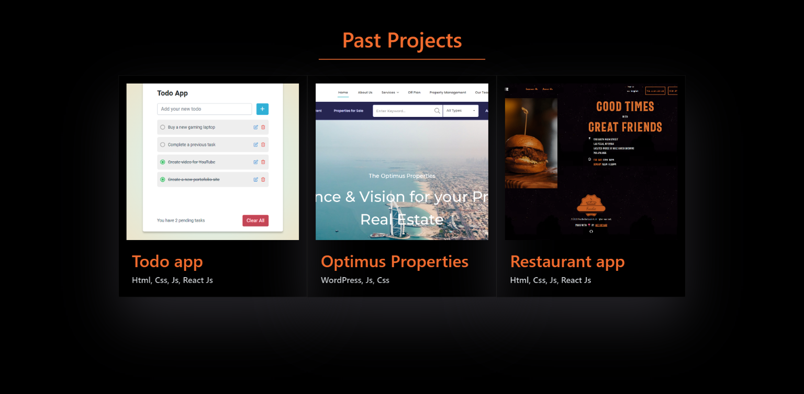
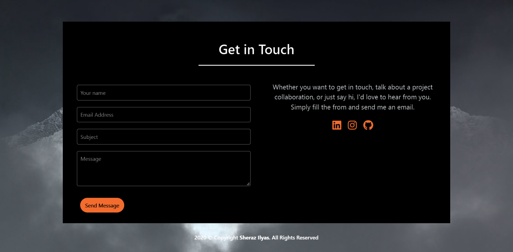

## My portfolio

<p align="center">
  <kbd>
</img>
  </kbd>
</p>

## Sections

### About

<p align="center">
  <kbd>
</img>
  </kbd>
</p>

### Services

<p align="center">
  <kbd>
</img>
  </kbd>
</p>

### Contact

<p align="center">
  <kbd>
</img>
  </kbd>
</p>

## Getting Started

```
node@v10.16.0 or higher
npm@6.9.0 or higher
git@2.17.1 or higher
```

## How To Use

From your command line, clone and run developerFolio:

```bash
# Clone this repository
$ git clone https://github.com/Sheraz-Ilyas/my-portfolio

# Go into the repository
$ cd my-portfolio

# Install dependencies
$ npm install

#Start's development server
$ npm start
---
```
